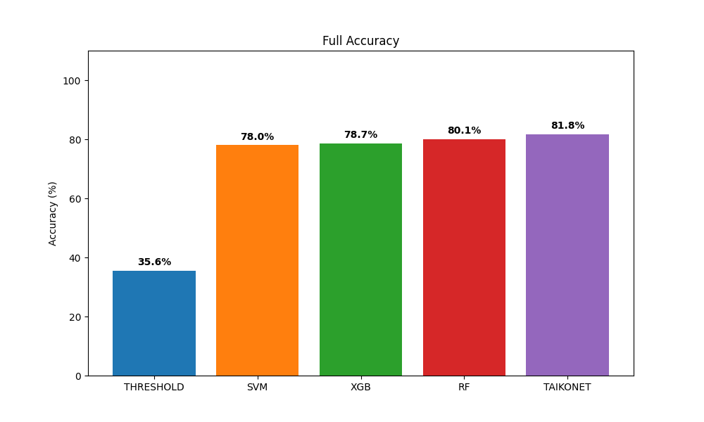
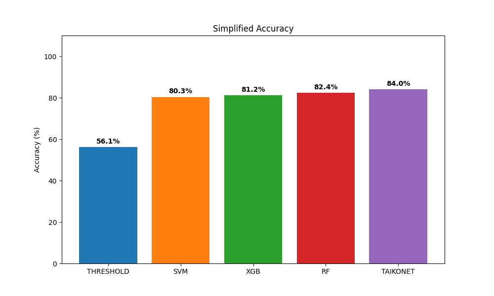

# 🥁 Taiko Controller AI: Deep Learning-Driven Hit Detection


An advanced, AI-powered embedded controller for the *Taiko no Tatsujin* rhythm game. This project replaces traditional, error-prone rule-based sensor logic with a custom Multilayer Perceptron (**TaikoNet**) to accurately classify drum hits, effectively eliminating mechanical crosstalk and hardware noise.

## 🚀 Project Overview

Building a physical drum controller introduces significant physical constraints: **vibration crosstalk** (striking one side triggers sensors on the other) and **uneven force distribution**. 

Standard rule-based logic (e.g., checking for the maximum peak value) frequently misclassifies these signals. This project solves this by using an Arduino to sample 4 analog sensors at 2000Hz, streaming the data via UART to a Python backend, where **TaikoNet** predicts the exact hit location in real-time (<1ms latency) and triggers keyboard inputs via PyAutoGUI.

## 🧠 The AI Advantage: TaikoNet vs. Threshold Logic

We evaluated standard threshold-based logic against our custom PyTorch architecture (**TaikoNet**). TaikoNet treats the 4 simultaneous sensor readings as a unique "vibration fingerprint," allowing it to map non-linear physical interactions.

### 📊 Performance Benchmarking

We compared **TaikoNet** against various machine learning models and traditional rule-based methods. We evaluate performance using two metrics:
- **Full Accuracy**: Classification across 5 classes (`Don_L`, `Don_R`, `Ka_L`, `Ka_R`, `Noise`).
- **Simple Accuracy**: Classification across 3 categories (`Don`, `Ka`, `Noise`), which is often more relevant for general rhythm game input.

| Method | Full Accuracy | Simple Accuracy | Paradigm | Strength |
| :--- | :---: | :---: | :--- | :--- |
| **Traditional Threshold** | 35.6% | 56.1% | Rule-based | Simple, low overhead |
| **SVM (RBF Kernel)** | 78.0% | 80.3% | Machine Learning | Robust to small datasets |
| **XGBoost** | 78.7% | 81.2% | Boosting | High efficiency |
| **Random Forest** | 80.1% | 82.4% | Ensemble | Good for non-linearities |
| **TaikoNet (Proposed)** | **81.8%** | **84.0%** | **Deep Learning (MLP)** | **Best at isolating intent** |

#### Full Accuracy Benchmarking


#### Simple Accuracy Benchmarking


> [!TIP]
> **Why use Simple Accuracy?**
> While TaikoNet is excellent at distinguishing between left and right hits, most players find that as long as the hit type (Don vs. Ka) is correct, the game remains playable. Simple Accuracy reflects the model's reliability in identifying the core hit intent.

> [!TIP]
> **TaikoNet Architecture:**
> * **Input Layer:** 4 Features (Raw analog peaks from `Don_L`, `Don_R`, `Ka_L`, `Ka_R`).
> * **Hidden Layers:** 3 Layers (64 → 32 → 16 neurons) utilizing ReLU activation and Dropout (0.2).
> * **Output Layer:** 5 Classes (`Don_Left`, `Don_Right`, `Ka_Left`, `Ka_Right`, `Noise`).

## 🔄 System Architecture & Data Flow

The system is designed for high-throughput, low-latency execution (<1ms inference) required by rhythm games.

**1. Hardware Layer (Arduino Uno)**
* **Sensors:** 4x Piezo/FSR sensors mapped to hardware interrupts.
* **Processing:** 2000Hz sampling with a low-level noise gate filter.
* **Output:** Continuous UART stream of normalized peak values.

**2. Communication Layer (Serial Interface)**
* **Protocol:** UART @ 115200 Baud via USB.
* **Data Stream:** Packets of 4-channel analog values.

**3. Software Layer (Python & PyTorch)**
* **Preprocessing:** `StandardScaler` transforms raw inputs into tensors.
* **Inference:** **TaikoNet** predicts the hit class (Don/Ka/Noise).
* **Visualization:** Real-time feedback via **PyQt5** dashboard.

**4. Output Layer (Game Interface)**
* **Mapping:** Predicted class triggers virtual keystrokes (`F`, `J`, `D`, `K`).
* **Execution:** `PyAutoGUI` injects inputs directly into the OS event loop.

## 🔌 Hardware Setup

* **Microcontroller:** Arduino Uno (ATmega328P) @ 16MHz.
* **Sensors:** 4 separate hit zones mapped to analog pins.
    * `A0`: Ka_Left (Rim)
    * `A1`: Don_Left (Center)
    * `A2`: Don_Right (Center)
    * `A3`: Ka_Right (Rim)
* **Sampling Rate:** 2000Hz, achieved via non-blocking `micros()` timers.

## 🛠️ Installation & Usage

### 1. Arduino Setup
Flash the provided C++ script to your Arduino:
1. Open `arduino_firmware/arduino_firmware.ino` in the Arduino IDE.
2. Ensure the baud rate is set to `115200`.
3. Upload the code to your board.

### 2. Python Environment Setup
This project uses **Poetry** for dependency management.

```bash
# Install dependencies
poetry install

# Enter the virtual environment
poetry shell
```

*Alternatively, using traditional pip:*
```bash
pip install torch pandas numpy scikit-learn pyqt5 pyautogui pyserial xgboost joblib
```

### 3. Model Training (Optional)
If you wish to retrain TaikoNet or perform a model comparison:
```bash
poetry run python src/model_trainer.py
```
*This updates `taiko_taikonet_model.pth` and scalers in the `models/` directory.*

### 4. Running the Controller
Execute the main visual interface to begin gameplay:
```bash
poetry run python src/taiko_main_visual.py
```
* Select your COM port.
* Select **"TaikoNet"** from the AI dropdown.
* Start your game and play!

## 📁 Directory Structure

```text
📦 smart-taiko-controller
 ┣ 📂 arduino_firmware
 ┃ ┗ 📜 arduino_firmware.ino    # Firmware for sampling & UART streaming
 ┣ 📂 src
 ┃ ┣ 📜 taiko_main_visual.py     # PyQt5 GUI, inference, and PyAutoGUI triggers
 ┃ ┣ 📜 model_trainer.py         # Training loop & multi-model evaluation
 ┃ ┣ 📜 data_collector.py       # Utility for logging sensor data
 ┃ ┗ 📜 config.py                # Global hyperparameters & class labels
 ┣ 📂 models
 ┃ ┣ 📜 taiko_taikonet_model.pth # Best trained MLP weights
 ┃ ┣ 📜 scaler.pkl               # StandardScaler for input normalization
 ┃ ┗ 📜 model_comparison_full.png # Accuracy benchmarking visualization
 ┣ 📂 data
 ┃ ┗ 📜 sensor_log.csv           # Raw sensor dataset for training
 ┣ 📂 test
 ┃ ┗ 📜 ...                      # CLI tools for serial/keyboard testing
 ┣ 📜 pyproject.toml             # Poetry project definition
 ┗ 📜 README.md
```